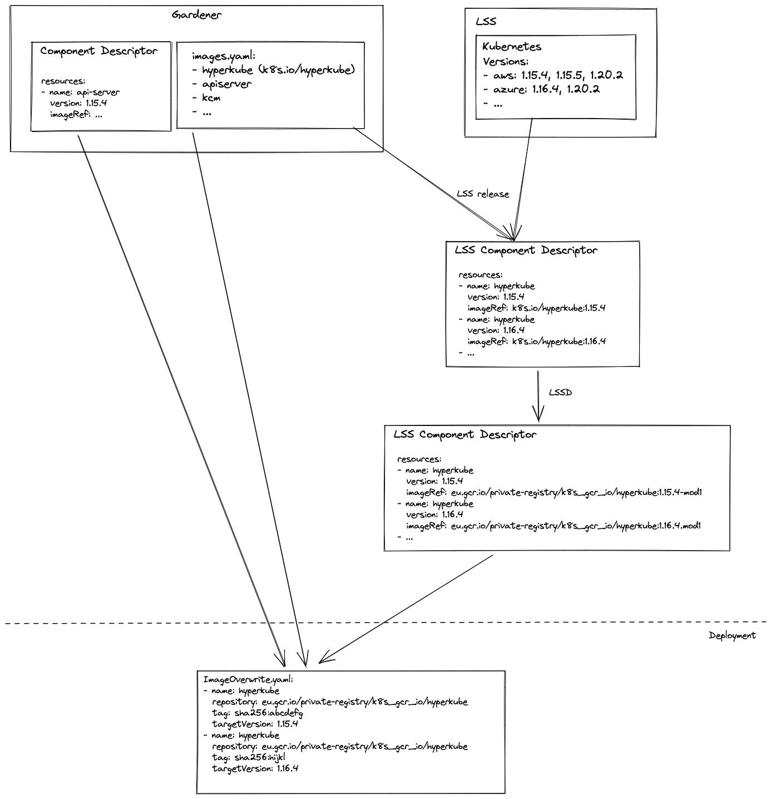

# Image Vector

This repo describes the image vectors that is used by [Gardener](https://github.com/gardener/gardener) and other components to describe deployed oci images.

In particular the interaction (image-vector -> ComponentDescriptor -> image-vector) with the CNUDIE Component descriptor is described.

